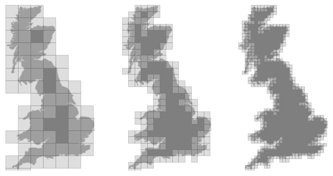

```python
from IPython.display import HTML, display
%matplotlib inline
```

# Temporal vectorization
The Mandelbrot set is the set of complex numbers c for which the function $f_c(z) = z^2 + c$ does not diverge when iterated from z = 0, i.e., for which the sequence $f_c(0)$, $f_c(f_c(0))$, etc., remains bounded in absolute value. It is very easy to compute, but it can take a very long time because you need to ensure a given number does not diverge. This is generally done by iterating the computation up to a maximum number of iterations, after which, if the number is still within some bounds, it is considered non-divergent. Of course, the more iterations you do, the more precision you get.

 

<figcaption>Romanesco broccoli, showing self-similar form approximating a natural fractal. Image by <a href=https://commons.wikimedia.org/wiki/File:Fractal_Broccoli.jpg>Jon Sullivan</a>, 2004.</figcaption>Python implementation


```python
import math

def mandelbrot_python(xmin, xmax, ymin, ymax, xn, yn, maxiter, horizon=2.0):
    def mandelbrot(z, maxiter):
        c=z
        for n in range(maxiter):
            if abs(z)>horizon: return n
            z=z*z+c
        return maxiter
    r1 =[xmin+i*(xmax-xmin)/xn for i in range(xn)]
    r2 = [ymin+i*(ymax-ymin)/yn for i in range(yn)]
    return [mandelbrot(complex(r, i), maxiter) for r in r1 for i in r2]
```

The interesting (and slow) part of this code is the `mandelbrot` function that actually computes the sequence $f_c(f_c(f_c...)))$. The vectorization of such code is not totally straightforward because the internal `return` implies a differential processing of the element. Once it has diverged, we don't need to iterate any more and we can safely return the iteration count at divergence.

## NumPy implementation
The trick is to search at each iteration values that have not yet diverged and update relevant information for these values and only these values. Because we start from Z = 0, we know that each value will be updated at least once (when they're equal to 0, they have not yet diverged) and will stop being updated as soon as they've diverged. To do that, we'll use NumPy fancy indexing with the `less(x1,x2)` function that `return` the truth value of (x1 < x2) element-wise.


```python
import numpy as np
def mandelbrot_numpy(xmin, xmax, ymin, ymax, xn, yn, maxiter, horizon=2.0):
    X = np.linspace(xmin, xmax, xn, dtype=np.float32)
    Y = np.linspace(ymin, ymax, yn, dtype=np.float32)
    C = X + Y[:,None]*1j
    N = np.zeros(C.shape, dtype=int)
    Z = np.zeros(C.shape, np.complex64)
    for n in range(maxiter):
        I = np.less(abs(Z), horizon)
        N[I] = n
        Z[I] = Z[I]**2 + C[I]
    N[N == maxiter-1] = 0
    return Z, N
```

## Faster NumPy implementation
The gain is roughly a 5x factor, not as much as we could have expected. Part of the problem is that the `np.less` function implies xn × yn tests at every iteration while we know that some values have already diverged. Even if these tests are performed at the C level (through NumPy), the cost is nonetheless significant. Another approach proposed by [Dan Goodman][] is to work on a dynamic array at each iteration that stores only the points which have not yet diverged. It requires more lines but the result is faster and leads to a 10x factor speed improvement compared to the Python version.

[Dan Goodman]: https://thesamovar.wordpress.com


```python
def mandelbrot_numpy_2(xmin, xmax, ymin, ymax, xn, yn, itermax, horizon=2.0):
    Xi, Yi = np.mgrid[0:xn, 0:yn]
    Xi, Yi = Xi.astype(np.uint32), Yi.astype(np.uint32)
    X = np.linspace(xmin, xmax, xn, dtype=np.float32)[Xi]
    Y = np.linspace(ymin, ymax, yn, dtype=np.float32)[Yi]
    C = X + Y*1j
    N_ = np.zeros(C.shape, dtype=np.uint32)
    Z_ = np.zeros(C.shape, dtype=np.complex64)
    Xi.shape = Yi.shape = C.shape = xn*yn

    Z = np.zeros(C.shape, np.complex64)
    for i in range(itermax):
        if not len(Z): break

        # Compute for relevant points only
        np.multiply(Z, Z, Z)
        np.add(Z, C, Z)

        # Failed convergence
        I = abs(Z) > horizon
        N_[Xi[I], Yi[I]] = i+1
        Z_[Xi[I], Yi[I]] = Z[I]

        # Keep going with those who have not diverged yet
        np.negative(I,I)
        Z = Z[I]
        Xi, Yi = Xi[I], Yi[I]
        C = C[I]
    return Z_.T, N_.T
```

## Visualization
In order to visualize our results, we could directly display the N array using the matplotlib `imshow` command, but this would result in a "banded" image that is a known consequence of *the escape count algorithm* that we've been using. Such banding can be eliminated by using a fractional escape count. This can be done by measuring how far the iterated point landed outside of the escape cutoff. See the reference below about the renormalization of the escape count. Here is a picture of the result where we use recount normalization, and added a power normalized color map (gamma=0.3) as well as light shading.


<figcaption>The Mandelbrot as rendered by matplotlib using recount normalization, power normalized color map (gamma=0.3) and light shading.</figcaption>


```python
#%%writefile frac_dimension.py
import sys, os
import numpy as np

def frac_dimension(z, threshold=0.9):
    def pointcount(z,k):
        s=np.add.reduceat(np.add.reduceat(
            z, np.arange(0, z.shape[0], k), axis=0 ),
                         np.arange(0, z.shape[1], k), axis=1)
        return len(np.where( ( s>0 ) & (s<k*k) )[0])
    z=(z<threshold)
    p = min(z.shape)
    n=2**np.floor(np.log(p)/np.log(2))
    n=int(np.log(n)/np.log(2))
    sizes=2**np.arange(n, 1, -1)
    counts = []
    for size in sizes:
        counts.append(pointcount(z, size))
    coeffs = np.polyfit(np.log(sizes), np.log(counts), 1)
    return -coeffs[0]

if __name__=='__main__':
    from scipy import misc
    import matplotlib.pyplot as plt
    import matplotlib.patches as patches
    
    fname = 'Great-Britain.png'
    z=1.0 - misc.imread(fname)/255
    
    print(frac_dimension(z, threshold=0.25))
    
    sizes = 128, 64, 32
    xmin, xmax = 0, z.shape[1]
    ymin, ymax = 0, z.shape[0]
    fig = plt.figure(figsize=(10, 5))

    for i, size in enumerate(sizes):
        ax = plt.subplot(1, len(sizes), i+1, frameon=False)
        ax.imshow(1-z, plt.cm.gray, interpolation="bicubic", vmin=0, vmax=1,
                  extent=[xmin, xmax, ymin, ymax], origin="upper")
        ax.set_xticks([])
        ax.set_yticks([])
        for y in range(z.shape[0]//size+1):
            for x in range(z.shape[1]//size+1):
                s = (z[y*size:(y+1)*size, x*size:(x+1)*size] > 0.25).sum()
                if s > 0 and s < size*size:
                    rect = patches.Rectangle(
                        (x*size, z.shape[0]-1-(y+1)*size),
                        width=size, height=size,
                        linewidth=.5, edgecolor='.25',
                        facecolor='.75', alpha=.5)
                    ax.add_patch(rect)

    plt.tight_layout()
    plt.savefig("fractal-dimension.png")
    plt.show()

```

    /usr/local/Cellar/pyenv/1.2.0/versions/miniconda3-latest/lib/python3.6/site-packages/ipykernel_launcher.py:28: DeprecationWarning: `imread` is deprecated!
    `imread` is deprecated in SciPy 1.0.0, and will be removed in 1.2.0.
    Use ``imageio.imread`` instead.


    1.24032513564





